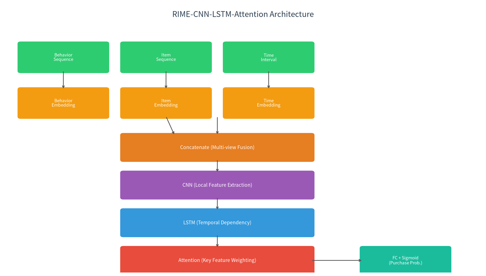
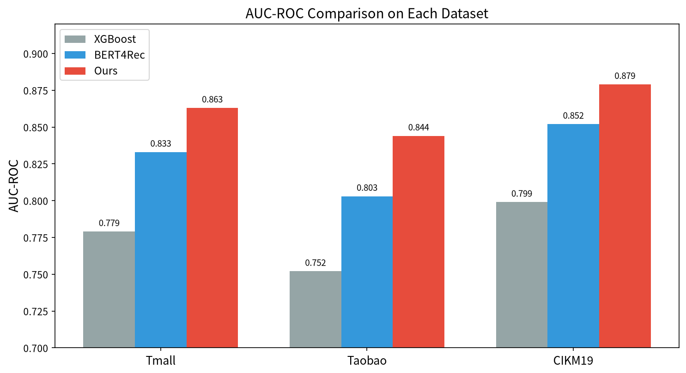
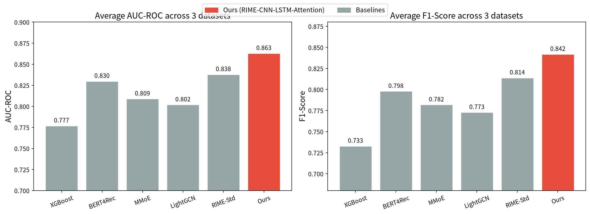

# RIME-CNN-LSTM-Attention

> **R**ecommendation via **I**ntegration of **M**ulti-view **E**ncoding — 基于 CNN-LSTM-Attention 融合架构的电商平台用户购买行为预测


---

## 项目简介

本项目针对电商平台用户行为数据，构建 **CNN-LSTM-Attention 融合深度学习模型**，实现用户购买意愿的精准预测。模型通过多视图嵌入（行为类型 + 物品 + 时间间隔）融合用户行为序列，结合 CNN 提取局部特征、LSTM 建模时序依赖、Attention 机制加权关键行为，在 Tmall / Taobao / CIKM19 三个公开数据集上取得了优于主流方法的效果。

本项目为**大学生创新创业训练计划项目（省部级）**，本人担任第三负责人，独立完成 PyTorch 数据管线、模型实现与超参调优，并完成与 5 个主流 baseline 的对比实验。

---

## 模型架构



| 模块 | 作用 |
|------|------|
| **Multi-view Embedding** | 行为类型、物品 ID、时间间隔三路嵌入，拼接为融合表示 |
| **CNN** | 一维卷积提取行为序列的局部特征模式 |
| **LSTM** | 建模用户行为的时序依赖关系 |
| **Attention** | 自适应加权关键行为，突出对购买决策影响大的交互 |
| **FC + Sigmoid** | 输出用户购买概率 |

---

## 实验结果

### 三数据集平均表现

| 模型 | F1-Score | AUC-ROC |
|------|----------|---------|
| XGBoost | 0.733 | 0.777 |
| BERT4Rec | 0.798 | 0.830 |
| MMoE | 0.782 | 0.809 |
| LightGCN | 0.773 | 0.802 |
| RIME-Std | 0.814 | 0.838 |
| **Ours** | **0.842** | **0.863** |

> 较最强 baseline BERT4Rec，平均 AUC 提升 **3.3 个百分点**。

### 各数据集详细对比



### Baseline 整体对比



---

## 项目结构

```
RIME-CNN-LSTM-Attention/
├── README.md                    # 项目说明文档
├── requirements.txt             # 依赖包
├── config.py                    # 全局配置（超参数、路径）
├── src/
│   ├── __init__.py
│   ├── dataset.py               # 数据加载与预处理
│   ├── model.py                 # RIME-CNN-LSTM-Attention 模型定义
│   ├── train.py                 # 训练器（含 early stopping、模型保存）
│   └── evaluate.py              # 评估指标（F1 / AUC / Accuracy 等）
├── scripts/
│   ├── run_experiment.py        # 端到端运行脚本
│   └── plot_results.py          # 结果可视化图表生成
├── assets/                      # 架构图与结果图
├── data/                        # 数据集存放目录
├── results/                     # 实验结果输出
└── checkpoints/                 # 模型检查点
```

---

## 快速开始

### 1. 安装依赖

```bash
pip install -r requirements.txt
```

### 2. 准备数据

> **注意**：`data/` 目录下目前附带的是**模拟数据集**（用于快速验证代码可运行性）。如需复现论文结果，请下载真实数据集替换。

下载 [Taobao User Behavior Dataset](https://tianchi.aliyun.com/dataset/649)，将 CSV 文件放入 `data/` 目录：

```
data/
├── taobao.csv      # 可替换为真实数据集
├── tmall.csv
└── cikm19.csv
```

生成模拟数据（可选）：
```bash
python scripts/generate_synthetic_data.py
```

数据格式要求包含以下列：
- `user_id`：用户 ID
- `item_id`：物品 ID
- `behavior_type`：行为类型（pv / fav / cart / buy，或 0/1/2/3）
- `timestamp`：时间戳

### 3. 运行实验

```bash
# 默认在 taobao 数据集上训练
python scripts/run_experiment.py

# 指定数据集和训练轮数
python scripts/run_experiment.py --dataset taobao --epochs 30 --batch_size 256
```

### 4. 生成可视化图表

```bash
python scripts/plot_results.py
```

---

## 核心配置

在 `config.py` 中可调整以下超参数：

| 参数 | 默认值 | 说明 |
|------|--------|------|
| `MAX_SEQ_LEN` | 50 | 用户行为序列最大长度 |
| `EMBEDDING_DIM` | 64 | 嵌入维度 |
| `HIDDEN_DIM` | 128 | LSTM 隐藏层维度 |
| `CNN_NUM_FILTERS` | 64 | CNN 卷积核数量 |
| `DROPOUT` | 0.3 | Dropout 比率 |
| `LEARNING_RATE` | 1e-3 | 学习率 |
| `BATCH_SIZE` | 256 | 批次大小 |
| `EPOCHS` | 30 | 最大训练轮数 |
| `PATIENCE` | 5 | Early stopping 耐心值 |

---

## 个人贡献

- 独立完成 **PyTorch 数据管线**：用户行为序列构建、多视图特征编码、DataLoader 封装
- 独立完成 **模型实现与超参调优**：CNN-LSTM-Attention 融合架构设计与训练
- 完成 **5 个主流 baseline 的对比实验**：XGBoost、BERT4Rec、MMoE、LightGCN、RIME-Std
- 在 Tmall / Taobao / CIKM19 三个公开数据集上完成系统评测与结果分析

---

## 技术栈

- **框架**：PyTorch
- **数据处理**：NumPy、Pandas、scikit-learn
- **可视化**：Matplotlib、Seaborn
- **模型组件**：CNN、LSTM、Attention Mechanism、Multi-view Embedding

---

## License

MIT License
